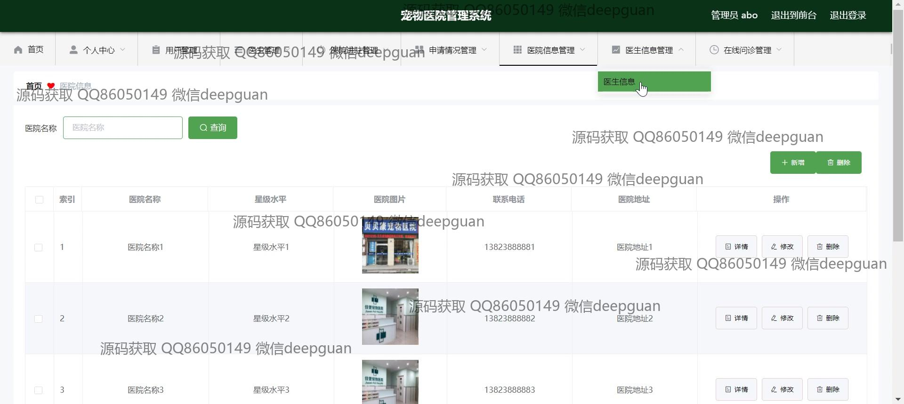

<h1 align="center">宠物医院管理系统+vue</h1>

## 简介
宠物医院管理系统：角色分为用户、医生；功能包括医院信息管理、医生信息管理、在线问诊和宠物信息管理等，提供简洁易用的注册、登录及用户信息维护界面。    --计算机毕业设计源码；毕设源码；java毕业设计源码

## 联系方式

<h3 align="center">获取完整代码与数据库文件 + 微信：deepguan QQ: 86050149 QQ群: 783742310</h3>

<h3 align="center">可帮忙远程部署 包运行成功！提供远程部署、修改代码、设计文档指导、代码讲解等服务！</h3>

## 功能介绍（完整见运行截图）
管理员：基本功能包括登录、注册和退出。系统提供后台管理功能，通过导航栏访问不同模块，如医院信息和医生信息管理。管理员可以查看和管理医院及医生的详细信息，进行用户管理，包括新增、删除及修改用户信息。系统支持上传医院相关证件，有助于维护合法认证。管理员可以管理在线问诊，增删问诊记录并查看详细信息，同时处理问诊回复。医院数据的管理可通过账号、姓名、星级水平等进行查询和操作。

用户：用户可通过注册及登录访问系统，注册过程中需要输入账号、密码、姓名及手机号等信息。登录后，可以填写个人资料、查看医生信息和医院信息，选择查看医院和医生的详情。同时，用户能够参与在线问诊，查询与管理涉及的宠物信息。界面提供友好的交互操作，通过宠物名称或医生姓名等搜索框进行信息过滤和查找，并有详细查看、修改及删除功能按钮。

医生：医生可以通过注册或身份选择进入系统进行登录，注册时需填写账号、密码、姓名、手机号、邮箱以及识别码。在登录后，医生可以进行个人信息管理，查看并修改自己的资料。同时，医生能够管理自己的问诊记录，通过系统联系宠物主人或其他医生，并处理问诊回复。医生信息管理界面显示医院及医生的综合信息，包括坐诊时间和相关介绍，支持修改和删除操作。

## 运行截图

本代码来源于网络,仅供学习参考使用!

